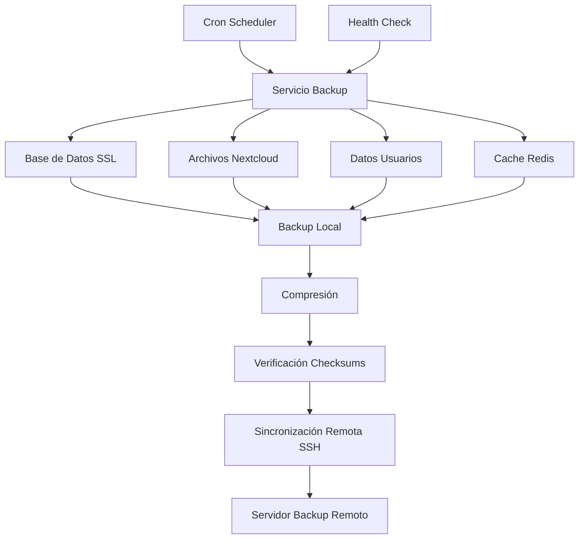

# 💾 Sistema de Backup Automatizado - Nextcloud Multi-Desktop

Este documento describe el sistema integrado de backup automatizado que protege todos los componentes críticos del entorno Nextcloud Multi-Desktop.

## 📋 Tabla de Contenidos

- [🎯 Funcionalidades](#-funcionalidades)
- [🏗️ Arquitectura del Backup](#️-arquitectura-del-backup)
- [⚙️ Configuración](#️-configuración)
- [🚀 Operación](#-operación)
- [📊 Monitoreo](#-monitoreo)
- [🔧 Mantenimiento](#-mantenimiento)
- [🚨 Recuperación](#-recuperación)

## 🎯 Funcionalidades

### ✅ Componentes Respaldados

| Componente | Método | Frecuencia | Retención |
|------------|--------|-----------|-----------|
| **Base de Datos MariaDB** | mysqldump + SSL | Automático | 30 días |
| **Aplicación Nextcloud** | rsync | Automático | 30 días |
| **Datos de Usuarios** | rsync | Automático | 30 días |
| **Cache Redis** | Snapshot | Automático | 7 días |
| **Configuraciones** | Archive | Manual/Auto | 90 días |

### 🔐 Características de Seguridad

- **Conexiones SSL/TLS** a MariaDB
- **Encriptación SSH** para transferencias remotas
- **Verificación de checksums** para integridad
- **Autenticación por llaves** SSH
- **Logs auditables** de todas las operaciones

### 🌐 Capacidades de Red

- **Backup local** en volumen Docker persistente
- **Sincronización remota** via RSYNC over SSH
- **Red segmentada** - acceso controlado desde red principal
- **Resolución DNS** interna para servicios

## 🏗️ Arquitectura del Backup

### 🔄 Flujo de Backup



### 📁 Estructura de Directorios

```
nextcloud-backup/
├── Dockerfile                    # Imagen del servicio de backup
├── entrypoint.sh                # Script de inicialización
├── config/                      # Configuraciones
│   ├── backup.conf             # Configuración principal
│   └── ssh-keys/               # Llaves SSH (montado desde host)
├── scripts/                     # Scripts de backup
│   ├── backup-database.sh      # Backup específico de BD
│   ├── backup-files.sh         # Backup de archivos
│   ├── sync-remote.sh          # Sincronización remota
│   └── health-check.sh         # Verificación de salud
└── logs/                       # Logs del servicio
    ├── backup.log              # Log principal
    ├── database.log            # Log específico de BD
    └── sync.log                # Log de sincronización
```

## ⚙️ Configuración

### 🔧 Variables de Entorno

```bash
# === CONFIGURACIÓN DE BASE DE DATOS ===
BACKUP_DB_HOST=db                     # Host de la base de datos
BACKUP_DB_PORT=3306                   # Puerto de MariaDB
BACKUP_DB_NAME=${MYSQL_DATABASE}      # Nombre de la BD
BACKUP_DB_USER=${MYSQL_USER}          # Usuario de la BD
BACKUP_DB_PASSWORD=${MYSQL_PASSWORD}  # Contraseña de la BD
BACKUP_DB_ROOT_PASSWORD=${MYSQL_ROOT_PASSWORD}  # Password root

# === CONFIGURACIÓN DE SERVIDOR REMOTO ===
BACKUP_REMOTE_HOST=backup-server.local    # Host del servidor de backup
BACKUP_REMOTE_USER=backup                 # Usuario SSH
BACKUP_REMOTE_PATH=/home/backup/nextcloud # Ruta destino
BACKUP_REMOTE_PORT=22                     # Puerto SSH

# === CONFIGURACIÓN DE BACKUP ===
BACKUP_RETENTION_DAYS=30              # Días de retención
BACKUP_COMPRESSION=true               # Comprimir backups
BACKUP_VERIFY_CHECKSUMS=true         # Verificar integridad
BACKUP_RUN_INITIAL=false              # Ejecutar backup inicial
LOG_RETENTION_DAYS=7                  # Retención de logs

# === CONFIGURACIÓN DEL SISTEMA ===
TZ=${TZ}                              # Zona horaria
PROJECT_NAME=${PROJECT_NAME}          # Nombre del proyecto
```

### 🔑 Configuración SSH

#### 1. Generar Llaves SSH

```bash
# En el host (directorio del proyecto)
ssh-keygen -t ed25519 -f ./ssh-keys/backup_key -C "nextcloud-backup-$(date +%Y%m%d)"
```

#### 2. Configurar Servidor Remoto

```bash
# En el servidor de backup remoto
# Crear usuario de backup
sudo useradd -m -s /bin/bash backup

# Configurar llaves SSH
sudo mkdir -p /home/backup/.ssh
sudo cp backup_key.pub /home/backup/.ssh/authorized_keys
sudo chown -R backup:backup /home/backup/.ssh
sudo chmod 700 /home/backup/.ssh
sudo chmod 600 /home/backup/.ssh/authorized_keys

# Crear directorio de backup
sudo mkdir -p /home/backup/nextcloud
sudo chown backup:backup /home/backup/nextcloud
```

## 🚀 Operación

### ▶️ Iniciar el Servicio

```bash
# Iniciar servicio de backup
docker-compose up -d nextcloud-backup

# Verificar estado
docker-compose ps nextcloud-backup

# Ver logs en tiempo real
docker-compose logs -f nextcloud-backup
```

### 🔄 Backup Manual

```bash
# Ejecutar backup completo manualmente
docker-compose exec nextcloud-backup /app/scripts/backup-manual.sh

# Backup solo de base de datos
docker-compose exec nextcloud-backup /app/scripts/backup-database.sh

# Backup solo de archivos
docker-compose exec nextcloud-backup /app/scripts/backup-files.sh

# Solo sincronización remota
docker-compose exec nextcloud-backup /app/scripts/sync-remote.sh
```

### ⏰ Programación Automática

El servicio incluye cron jobs automáticos:

```bash
# Backup completo diario a las 2:00 AM
0 2 * * * /app/scripts/backup-full.sh

# Sincronización remota cada 6 horas
0 */6 * * * /app/scripts/sync-remote.sh

# Limpieza de backups antiguos semanal
0 3 * * 0 /app/scripts/cleanup-old-backups.sh

# Health check cada 5 minutos
*/5 * * * * /app/scripts/health-check.sh
```

## 📊 Monitoreo

### 🏥 Health Check

```bash
# Verificar salud del servicio
docker-compose exec nextcloud-backup /app/scripts/health-check.sh

# Ver estado detallado
curl http://localhost:8080/health 2>/dev/null || echo "Health endpoint not available"

# Verificar desde Docker Compose
docker-compose ps nextcloud-backup
```

### 📋 Logs y Auditoría

```bash
# Ver logs principales
docker-compose logs nextcloud-backup

# Ver logs específicos
docker-compose exec nextcloud-backup tail -f /app/logs/backup.log
docker-compose exec nextcloud-backup tail -f /app/logs/database.log
docker-compose exec nextcloud-backup tail -f /app/logs/sync.log

# Ver estadísticas de backup
docker-compose exec nextcloud-backup cat /app/logs/backup-stats.json
```

### 📈 Métricas de Backup

```bash
# Tamaño de backups
docker-compose exec nextcloud-backup du -sh /backups/local/*

# Últimos backups
docker-compose exec nextcloud-backup ls -lat /backups/local/

# Verificar integridad
docker-compose exec nextcloud-backup /app/scripts/verify-backups.sh
```

## 🔧 Mantenimiento

### 🧹 Limpieza Manual

```bash
# Limpiar backups locales antiguos
docker-compose exec nextcloud-backup /app/scripts/cleanup-local.sh

# Limpiar logs antiguos
docker-compose exec nextcloud-backup find /app/logs -name "*.log" -mtime +7 -delete

# Limpiar backups remotos (cuidado!)
docker-compose exec nextcloud-backup /app/scripts/cleanup-remote.sh --dry-run
```

### 🔄 Actualizar Configuración

```bash
# Editar configuración
docker-compose exec nextcloud-backup nano /app/config/backup.conf

# Recargar configuración (reiniciar servicio)
docker-compose restart nextcloud-backup
```

### 🔑 Rotar Llaves SSH

```bash
# Generar nuevas llaves
ssh-keygen -t ed25519 -f ./ssh-keys/backup_key_new -C "nextcloud-backup-$(date +%Y%m%d)"

# Actualizar servidor remoto
# (copiar nueva llave pública)

# Probar nueva llave
docker-compose exec nextcloud-backup ssh -i /app/config/ssh-keys/backup_key_new backup@backup-server.local echo "Test OK"

# Reemplazar llave antigua
mv ./ssh-keys/backup_key ./ssh-keys/backup_key_old
mv ./ssh-keys/backup_key_new ./ssh-keys/backup_key

# Reiniciar servicio
docker-compose restart nextcloud-backup
```

## 🚨 Recuperación

### 🔄 Recuperación Completa

#### 1. Preparar el Entorno

```bash
# Parar servicios
docker-compose down

# Limpiar datos existentes (¡CUIDADO!)
sudo rm -rf ./db/* ./nextcloud/* ./nextcloud_data/* ./redis/*
```

#### 2. Restaurar Base de Datos

```bash
# Iniciar solo MariaDB
docker-compose up -d db

# Esperar a que esté listo
docker-compose logs -f db

# Restaurar desde backup más reciente
BACKUP_FILE="/backups/local/database/nextcloud_$(date +%Y%m%d)_*.sql.gz"
docker-compose exec nextcloud-backup gunzip -c $BACKUP_FILE | docker-compose exec -T db mysql -u root -p nextcloud
```

#### 3. Restaurar Archivos

```bash
# Restaurar aplicación Nextcloud
docker-compose exec nextcloud-backup rsync -av /backups/local/nextcloud/ /data/nextcloud/

# Restaurar datos de usuarios
docker-compose exec nextcloud-backup rsync -av /backups/local/nextcloud_data/ /data/nextcloud_data/

# Corregir permisos
docker-compose exec nextcloud-backup chown -R www-data:www-data /data/nextcloud*
```

#### 4. Iniciar Servicios

```bash
# Iniciar todos los servicios
docker-compose up -d

# Verificar funcionamiento
curl -k https://nextcloud.net
```

### 🎯 Recuperación Selectiva

#### Restaurar Solo Base de Datos

```bash
# Hacer backup del estado actual
docker-compose exec db mysqldump -u root -p nextcloud > current_backup_$(date +%Y%m%d_%H%M%S).sql

# Restaurar desde backup específico
BACKUP_DATE="20241101"
docker-compose exec nextcloud-backup gunzip -c /backups/local/database/nextcloud_${BACKUP_DATE}_*.sql.gz | docker-compose exec -T db mysql -u root -p nextcloud
```

#### Restaurar Archivos Específicos

```bash
# Restaurar solo configuración de Nextcloud
docker-compose exec nextcloud-backup rsync -av /backups/local/nextcloud/config/ /data/nextcloud/config/

# Restaurar datos de usuario específico
USER_ID="admin"
docker-compose exec nextcloud-backup rsync -av /backups/local/nextcloud_data/${USER_ID}/ /data/nextcloud_data/${USER_ID}/
```

### ✅ Verificación Post-Recuperación

```bash
# Verificar servicios
docker-compose ps

# Verificar acceso a Nextcloud
curl -k https://nextcloud.net

# Verificar base de datos
docker-compose exec db mysql -u root -p -e "SELECT COUNT(*) FROM nextcloud.oc_users;"

# Ejecutar mantenimiento de Nextcloud
docker-compose exec nextcloud php occ maintenance:mode --on
docker-compose exec nextcloud php occ db:add-missing-indices
docker-compose exec nextcloud php occ files:scan --all
docker-compose exec nextcloud php occ maintenance:mode --off
```

---

## 🛡️ Mejores Prácticas

### 🔐 Seguridad
- Usar **llaves SSH** sin contraseña con passphrases
- **Cifrar backups** antes de enviarlos remotamente
- **Rotar llaves** regularmente
- **Auditar accesos** al servidor de backup

### 📊 Monitoreo
- Configurar **alertas** por backup fallido
- **Verificar integridad** de backups periódicamente
- **Probar recuperación** regularmente
- **Documentar** procedimientos de recuperación

### 🎯 Rendimiento
- Programar backups en **horarios de baja actividad**
- Usar **compresión** para reducir espacio
- Configurar **retención apropiada** según necesidades
- **Monitorear espacio** en disco regularmente

---

**📅 Última actualización**: Noviembre 2025  
**🏷️ Versión**: 1.0.0