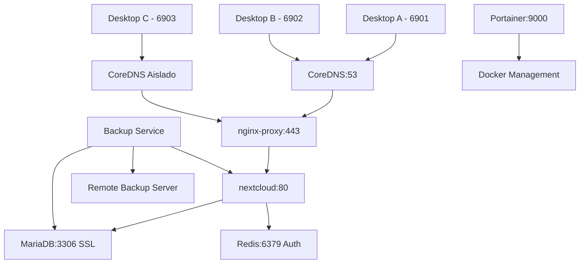
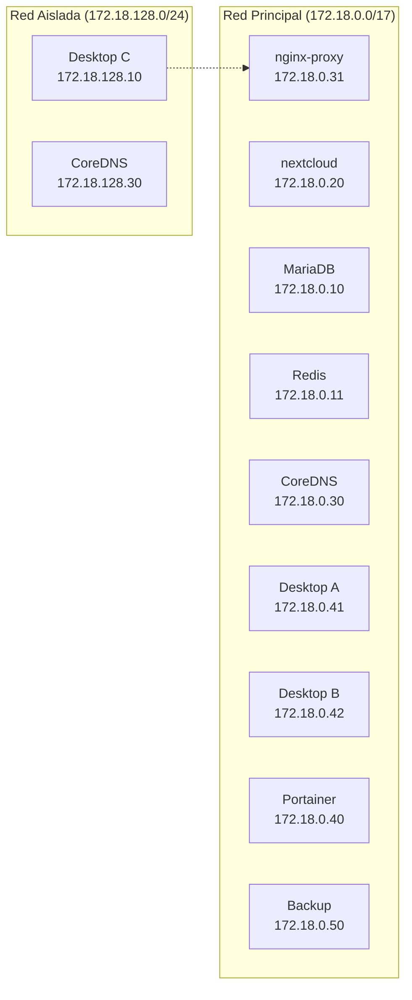

# 🌐 Nextcloud Multi-Desktop Environment

Un entorno empresarial completo de Nextcloud con escritorios virtuales, servidor DNS personalizado, proxy inverso nginx, sistema de backup automatizado y segmentación de red avanzada.

## 📋 Tabla de Contenidos

- [🏗️ Arquitectura del Sistema](#️-arquitectura-del-sistema)
- [📦 Componentes](#-componentes)
- [⚙️ Prerequisitos](#️-prerequisitos)
- [🚀 Instalación y Configuración](#-instalación-y-configuración)
- [🛠️ Scripts de Utilidad](#️-scripts-de-utilidad)
- [🔧 Configuración Avanzada](#-configuración-avanzada)
- [🐛 Solución de Problemas](#-solución-de-problemas)
- [📚 Documentación Adicional](#-documentación-adicional)

## 🏗️ Arquitectura del Sistema

### 📊 Diagramas de Arquitectura

El proyecto incluye diagramas PlantUML detallados que documentan la infraestructura:

- **`infrastructure-diagram.puml`** - Vista general de la arquitectura y componentes
- **`deployment-flow.puml`** - Flujo de despliegue y procesos de instalación  
- **`network-architecture.puml`** - Arquitectura de red detallada y seguridad

### 🔄 Flujo de Acceso Multi-Desktop



### 🏗️ Arquitectura de Red Avanzada



Para visualizar los diagramas completos, usa cualquier visor de PlantUML o herramientas online como [PlantText](https://www.planttext.com/) o extensiones de VS Code.

## 📦 Componentes

### 🗄️ Servicios de Aplicación
- **Nextcloud**: Plataforma de nube privada (Apache + PHP)
- **MariaDB**: Base de datos principal con SSL/TLS
- **Redis**: Cache y sesiones con autenticación

### 🌐 Servicios de Red
- **nginx-proxy**: Proxy inverso con SSL termination
- **CoreDNS**: Servidor DNS personalizado con zones locales

### 🖥️ Escritorios Virtuales (XFCE + noVNC)
- **Desktop A**: Cliente con acceso completo (puerto 6901)
- **Desktop B**: Cliente con acceso completo (puerto 6902)
- **Desktop C**: Cliente en red aislada (puerto 6903)

### 🔧 Servicios de Administración
- **Portainer**: Gestión web de contenedores Docker
- **nextcloud-backup**: Sistema automatizado de respaldos

### 🔒 Arquitectura de Red Segmentada
- **Red Principal (proxy_net_next)**: Servicios core + Desktops A y B
- **Red Aislada (isolated_client_net)**: Desktop C con acceso controlado

### 🌐 Dominios Configurados

- `nextcloud.net` - Dominio principal
- `*.nextcloud.net` - Subdominios wildcard
- `services.dev` - Servicios de desarrollo
- `example.local` - Ejemplos locales

## ⚙️ Prerequisitos

### 🐳 Software Requerido

```bash
# Docker y Docker Compose
docker --version
docker-compose --version
# o
docker compose version
```

### 🔧 Herramientas del Sistema

```bash
# Herramientas necesarias
sudo apt update
sudo apt install -y curl dig openssl lsof net-tools
```

### 📁 Estructura de Directorios

El proyecto creará automáticamente la siguiente estructura:

```
PROYECTO_V1/
├── docker-compose.yml          # Configuración principal
├── start.sh                    # Script de inicio completo
├── end.sh                      # Script de parada
├── generate-ssl-certs.sh       # Generador de certificados SSL
├── install-ssl-cert-system.sh  # Instalador de certificados en el sistema
├── setup-ssl-complete.sh       # Configuración SSL completa
├── coredns/                    # Configuración DNS
│   ├── Corefile               # Configuración CoreDNS
│   ├── zones/                 # Zonas DNS
│   └── INSTALACION/           # Scripts de configuración DNS
├── swag-config/               # Certificados SSL
├── nextcloud/                 # Archivos de Nextcloud
├── nextcloud_data/           # Datos de usuario
├── db/                       # Base de datos MariaDB
└── redis/                    # Datos de Redis
```

## 🚀 Instalación y Configuración

### 1️⃣ Configuración del Entorno

```bash
# 1. Clonar o descargar el proyecto
cd /path/to/PROYECTO_V1

# 2. Crear archivo de variables de entorno
cp .env.example .env
```

#### Variables de Entorno Principales

```bash
# Base de datos
MYSQL_ROOT_PASSWORD=tu_password_root_seguro
MYSQL_DATABASE=nextcloud
MYSQL_USER=nextcloud
MYSQL_PASSWORD=tu_password_db_seguro

# Redis
REDIS_PASSWORD=tu_password_redis_seguro

# Nextcloud
NEXTCLOUD_ADMIN_USER=admin
NEXTCLOUD_ADMIN_PASSWORD=tu_password_admin_seguro
NEXTCLOUD_TRUSTED_DOMAINS=nextcloud.net,localhost,192.168.1.100
OVERWRITEHOST=nextcloud.net
OVERWRITEPROTOCOL=https

# PHP
PHP_MEMORY_LIMIT=2G
PHP_UPLOAD_LIMIT=10G

# Zona horaria
TZ=America/El_Salvador
```

### 2️⃣ Configuración de Red Docker

```bash
# Crear red externa para los servicios
docker network create proxy_net_next
```

### 3️⃣ Configuración del DNS Local

#### Opción A: Script Automático (Recomendado)

```bash
# Ejecutar script de inicio completo
sudo ./start.sh
```

#### Opción B: Configuración Manual

```bash
# 1. Desactivar systemd-resolved
sudo ./coredns/INSTALACION/DESACTIVAR_SYSTEM_SESOLVE.sh

# 2. Verificar que el puerto 53 esté libre
sudo lsof -i :53

# 3. Iniciar el servicio DNS
docker-compose up -d coredns

# 4. Configurar DNS local
echo "nameserver 127.0.0.1" | sudo tee /etc/resolv.conf
```

#### Verificación del DNS

```bash
# Probar resolución DNS
dig nextcloud.net @127.0.0.1
dig www.nextcloud.net @127.0.0.1
dig services.dev @127.0.0.1

# Verificar conectividad externa
dig google.com @127.0.0.1
```

### 4️⃣ Generación de Certificados SSL

```bash
# Generar certificados autofirmados
./generate-ssl-certs.sh
```

#### Instalación de Certificados en el Sistema (Opcional)

```bash
# Instalar certificados para evitar advertencias del navegador
sudo ./install-ssl-cert-system.sh

# Para navegadores específicos
./install-ssl-cert-browsers.sh
```

### 5️⃣ Iniciar los Servicios

```bash
# Iniciar todos los servicios
docker-compose up -d

# Verificar estado
docker-compose ps

# Ver logs
docker-compose logs -f
```

### 6️⃣ Acceso a los Servicios

#### 🌐 Nextcloud
- **URL**: https://nextcloud.net
- **Usuario**: `admin` (configurado en `.env`)
- **Contraseña**: Configurada en `NEXTCLOUD_ADMIN_PASSWORD`

#### 🖥️ Escritorios Virtuales (noVNC)
- **Desktop A**: http://localhost:6901 (Red completa)
- **Desktop B**: http://localhost:6902 (Red completa) 
- **Desktop C**: http://localhost:6903 (Red aislada)
- **Contraseña VNC**: `MiPasswordFuerte123`

#### 🐳 Portainer (Gestión Docker)
- **URL**: http://localhost:9000 o https://localhost:9443
- **Configuración inicial**: Al primer acceso

#### 📊 Métricas CoreDNS
- **URL**: http://localhost:9153/metrics (Prometheus format)

## 🛠️ Scripts de Utilidad

### 🚀 Scripts de Gestión

| Script | Función | Uso |
|--------|---------|-----|
| `start.sh` | Inicio completo del sistema | `sudo ./start.sh` |
| `end.sh` | Parada y limpieza | `sudo ./end.sh` |

### 🔐 Scripts de Certificados SSL

| Script | Función | Uso |
|--------|---------|-----|
| `generate-ssl-certs.sh` | Genera certificados wildcard | `./generate-ssl-certs.sh` |
| `install-ssl-cert-system.sh` | Instala en almacén del sistema | `sudo ./install-ssl-cert-system.sh` |
| `install-ssl-cert-browsers.sh` | Instala en navegadores | `./install-ssl-cert-browsers.sh` |
| `setup-ssl-complete.sh` | Configuración SSL completa | `./setup-ssl-complete.sh` |
| `uninstall-ssl-cert-system.sh` | Desinstala certificados | `sudo ./uninstall-ssl-cert-system.sh` |

### 🌐 Scripts de DNS

| Script | Directorio | Función |
|--------|------------|---------|
| `DESACTIVAR_SYSTEM_SESOLVE.sh` | `coredns/INSTALACION/` | Desactiva systemd-resolved |
| `ACTIVAR_DNS_ALTERNO.sh` | `coredns/INSTALACION/` | Configura DNS alternativo |
| `ACTIVAR_SYSTEMA_RESOLVE.sh` | `coredns/INSTALACION/` | Reactiva systemd-resolved |

## 🔧 Configuración Avanzada

### 📝 Configuración DNS Personalizada

#### Editar Zonas DNS

```bash
# Editar zona nextcloud.net
nano coredns/zones/nextcloud.net.db

# Ejemplo de registro personalizado
subdomain  IN  A  192.168.1.100
api       IN  CNAME  @
```

#### Agregar Nueva Zona

```bash
# 1. Crear archivo de zona
nano coredns/zones/mi-dominio.local.db

# 2. Actualizar Corefile
nano coredns/Corefile
# Agregar: file /zones/mi-dominio.local.db mi-dominio.local

# 3. Reiniciar CoreDNS
docker-compose restart coredns
```

### �️ Configuración de Escritorios Virtuales

#### Acceso a los Escritorios

```bash
# Desktop A (Red completa)
# URL: http://localhost:6901
# VNC: vnc://localhost:5901
# Workspace: ./dataA

# Desktop B (Red completa)  
# URL: http://localhost:6902
# VNC: vnc://localhost:5902
# Workspace: ./dataB

# Desktop C (Red aislada)
# URL: http://localhost:6903  
# VNC: vnc://localhost:5903
# Workspace: ./dataC
```

#### Personalizar Escritorios

```bash
# Cambiar resolución
# Editar environment en docker-compose.yml:
VNC_RESOLUTION=1920x1080  # o 1600x900, 1366x768

# Cambiar contraseña VNC
VNC_PW=TuNuevaPassword

# Cambiar zona horaria
TZ=Europe/Madrid  # o tu zona horaria preferida
```

#### Instalar Software en Escritorios

```bash
# Entrar al contenedor
docker-compose exec xfce-desktop-a bash

# Instalar paquetes (como root)
apt update && apt install -y firefox-esr git nodejs npm

# O crear Dockerfile personalizado para instalar software
```

#### Diferencias de Red por Escritorio

| Desktop | Red | Acceso a Servicios | Uso Recomendado |
|---------|-----|-------------------|-----------------|
| A | Principal | Completo (nextcloud, portainer, backup) | Administración |
| B | Principal | Completo (nextcloud, portainer, backup) | Usuario avanzado |
| C | Aislada + Limitado | Solo nextcloud via proxy | Usuario final/invitado |

### �🔒 Configuración SSL Avanzada

#### Regenerar Certificados

```bash
# Eliminar certificados existentes
rm -rf swag-config/etc/letsencrypt/live/nextcloud.net/*

# Generar nuevos certificados
./generate-ssl-certs.sh

# Reiniciar proxy
docker-compose restart nginx-proxy
```

#### Personalizar Configuración SSL

```bash
# Editar configuración nginx
nano proxy-nginx/nginx.conf

# Reiniciar después de cambios
docker-compose restart nginx-proxy
```

### 🗄️ Configuración de Base de Datos

#### 💾 Sistema de Backup Automatizado

El sistema incluye un servicio automatizado de backup que respalda todos los componentes críticos:

**🔄 Backup Automático incluye:**
- Base de datos MariaDB (mysqldump con SSL)
- Archivos de aplicación Nextcloud
- Datos de usuarios (nextcloud_data)
- Cache Redis
- Sincronización remota via RSYNC over SSH

```bash
# Verificar estado del servicio de backup
docker-compose logs nextcloud-backup

# Ejecutar backup manual
docker-compose exec nextcloud-backup /app/scripts/backup-manual.sh

# Ver configuración de backup
docker-compose exec nextcloud-backup cat /app/config/backup.conf
```

**📋 Variables de Entorno de Backup:**
```bash
# Servidor remoto
BACKUP_REMOTE_HOST=backup-server.local
BACKUP_REMOTE_USER=backup
BACKUP_REMOTE_PATH=/home/backup/nextcloud
BACKUP_REMOTE_PORT=22

# Configuración
BACKUP_RETENTION_DAYS=30
BACKUP_COMPRESSION=true
BACKUP_VERIFY_CHECKSUMS=true
LOG_RETENTION_DAYS=7
```

#### Backup Manual Tradicional

```bash
# Backup manual de base de datos
docker-compose exec db mysqldump -u root -p nextcloud > backup_$(date +%Y%m%d_%H%M%S).sql
```

#### Restaurar Base de Datos

```bash
# Restaurar desde backup
docker-compose exec -T db mysql -u root -p nextcloud < backup_file.sql
```

## 🐛 Solución de Problemas

### 🌐 Problemas de DNS

#### DNS no resuelve dominios locales

```bash
# Verificar estado de CoreDNS
docker-compose logs coredns

# Verificar configuración DNS del sistema
cat /etc/resolv.conf

# Verificar puerto 53
sudo lsof -i :53

# Resetear DNS
sudo ./coredns/INSTALACION/DESACTIVAR_SYSTEM_SESOLVE.sh
docker-compose restart coredns
```

#### DNS no resuelve dominios externos

```bash
# Verificar conectividad externa
dig google.com @1.1.1.1

# Verificar configuración de forwarding en Corefile
nano coredns/Corefile
# Verificar línea: forward . 1.1.1.1 8.8.8.8
```

### 🔐 Problemas de SSL

#### Certificados no válidos

```bash
# Verificar certificados
openssl x509 -in swag-config/etc/letsencrypt/live/nextcloud.net/fullchain.pem -text -noout

# Regenerar certificados
./generate-ssl-certs.sh

# Verificar configuración nginx
docker-compose logs nginx-proxy
```

#### Advertencias del navegador

```bash
# Instalar certificados en el almacén del sistema
sudo ./install-ssl-cert-system.sh

# Para Chrome/Firefox
./install-ssl-cert-browsers.sh
```

### 🐳 Problemas de Docker

#### Contenedores no inician

```bash
# Verificar logs
docker-compose logs [servicio]

# Verificar puertos en uso
sudo netstat -tlnp | grep :443
sudo netstat -tlnp | grep :53

# Limpiar y reiniciar
docker-compose down
docker system prune -f
docker-compose up -d
```

#### Problemas de permisos

```bash
# Corregir permisos de Nextcloud
sudo chown -R www-data:www-data nextcloud/
sudo chown -R www-data:www-data nextcloud_data/

# Corregir permisos de MariaDB
sudo chown -R 999:999 db/
```

### 🌐 Problemas de Nextcloud

#### No se puede acceder a Nextcloud

```bash
# Verificar estado de servicios
docker-compose ps

# Verificar logs de Nextcloud
docker-compose logs nextcloud

# Verificar configuración de dominios confiables
docker-compose exec nextcloud php occ config:system:get trusted_domains
```

#### Errores de configuración

```bash
# Entrar al contenedor de Nextcloud
docker-compose exec nextcloud bash

# Ejecutar comandos occ
docker-compose exec nextcloud php occ maintenance:mode --on
docker-compose exec nextcloud php occ db:add-missing-indices
docker-compose exec nextcloud php occ maintenance:mode --off
```

### 🔄 Comandos de Limpieza y Reset

#### Reset Completo

```bash
# Parar servicios
docker-compose down

# Limpiar datos (¡CUIDADO! Elimina todos los datos)
sudo rm -rf db/* nextcloud_data/* redis/*

# Limpiar certificados
rm -rf swag-config/etc/letsencrypt/live/nextcloud.net/*

# Reiniciar
./generate-ssl-certs.sh
docker-compose up -d
```

#### Restaurar DNS del Sistema

```bash
# Restaurar systemd-resolved
sudo ./coredns/INSTALACION/ACTIVAR_SYSTEMA_RESOLVE.sh

# O manualmente
sudo systemctl enable systemd-resolved
sudo systemctl start systemd-resolved
sudo ln -sf /run/systemd/resolve/stub-resolv.conf /etc/resolv.conf
```

## 📚 Documentación Adicional

### 📖 Enlaces Útiles

- [Documentación oficial de Nextcloud](https://docs.nextcloud.com/)
- [CoreDNS Documentation](https://coredns.io/manual/toc/)
- [Docker Compose Reference](https://docs.docker.com/compose/)
- [nginx Configuration](https://nginx.org/en/docs/)
- [MariaDB Documentation](https://mariadb.org/documentation/)

### 🏷️ Puertos Utilizados

| Puerto | Servicio | Descripción | Acceso |
|--------|----------|-------------|---------|
| **DNS** ||||
| 53/UDP | CoreDNS | DNS queries | Interno |
| 53/TCP | CoreDNS | DNS over TCP | Interno |
| 9153/TCP | CoreDNS | Métricas Prometheus | http://localhost:9153 |
| **Web Services** ||||
| 80/TCP | nginx-proxy | HTTP (redirect to HTTPS) | http://localhost |
| 443/TCP | nginx-proxy | HTTPS | https://nextcloud.net |
| **Management** ||||
| 9000/TCP | Portainer | Web UI | http://localhost:9000 |
| 9443/TCP | Portainer | Web UI (HTTPS) | https://localhost:9443 |
| **Virtual Desktops** ||||
| 6901/TCP | Desktop A | noVNC Web Interface | http://localhost:6901 |
| 6902/TCP | Desktop B | noVNC Web Interface | http://localhost:6902 |
| 6903/TCP | Desktop C | noVNC Web Interface | http://localhost:6903 |
| 5901/TCP | Desktop A | VNC Direct | vnc://localhost:5901 |
| 5902/TCP | Desktop B | VNC Direct | vnc://localhost:5902 |
| 5903/TCP | Desktop C | VNC Direct | vnc://localhost:5903 |

### 🔍 Variables de Entorno Completas

```bash
# === CORE SERVICES ===
# Base de datos MariaDB
MYSQL_ROOT_PASSWORD=root_password_seguro
MYSQL_DATABASE=nextcloud
MYSQL_USER=nextcloud_user
MYSQL_PASSWORD=nextcloud_password_seguro

# Redis Cache
REDIS_PASSWORD=redis_password_seguro

# Nextcloud
NEXTCLOUD_ADMIN_USER=admin
NEXTCLOUD_ADMIN_PASSWORD=admin_password_seguro
NEXTCLOUD_TRUSTED_DOMAINS=nextcloud.net,localhost,192.168.1.100
OVERWRITEHOST=nextcloud.net
OVERWRITEPROTOCOL=https

# PHP Configuration
PHP_MEMORY_LIMIT=2G
PHP_UPLOAD_LIMIT=10G

# === BACKUP CONFIGURATION ===
# Servidor remoto para backups
BACKUP_REMOTE_HOST=backup-server.local
BACKUP_REMOTE_USER=backup
BACKUP_REMOTE_PATH=/home/backup/nextcloud
BACKUP_REMOTE_PORT=22

# Configuración de backup
BACKUP_RETENTION_DAYS=30
BACKUP_COMPRESSION=true
BACKUP_VERIFY_CHECKSUMS=true
BACKUP_RUN_INITIAL=false
LOG_RETENTION_DAYS=7

# === GENERAL SETTINGS ===
# Timezone
TZ=America/El_Salvador

# Project Name (para backup)
PROJECT_NAME=PROYECTO_V1

# Puertos (opcional, para desarrollo)
NEXTCLOUD_HTTP_PORT=8080
```

### 🎯 Casos de Uso

#### 🏢 Entorno Empresarial Multi-Usuario
- **Escritorios virtuales** para diferentes departamentos
- **Segmentación de red** con acceso controlado
- **Backup automatizado** para continuidad del negocio
- **DNS personalizado** para resolución de servicios internos

#### 🖥️ Laboratorio de Testing
- **Escritorios aislados** para pruebas independientes
- **Red segmentada** para simular diferentes escenarios
- **Reset rápido** de entornos de prueba
- **Monitoreo centralizado** via Portainer

#### 🏠 Uso Doméstico Avanzado
- **Nube privada familiar** con Nextcloud
- **Escritorios remotos** accesibles via web
- **Backup automático** de datos familiares
- **Certificados SSL** para seguridad completa

#### 🔬 Desarrollo y DevOps
- **Contenedores pre-configurados** para desarrollo
- **DNS local** para testing de aplicaciones
- **Proxy inverso** para simular producción
- **Arquitectura escalable** y documentada

---

## 🤝 Contribución

Si encuentras problemas o tienes sugerencias de mejora:

1. Crea un issue describiendo el problema
2. Propón una solución
3. Envía un pull request con los cambios

## 📄 Licencia

Este proyecto está bajo la licencia MIT. Ver `LICENSE` para más detalles.

---

**🔧 Mantenido por**: Tu Nombre  
**📅 Última actualización**: Octubre 2025  
**🏷️ Versión**: 1.0.0
